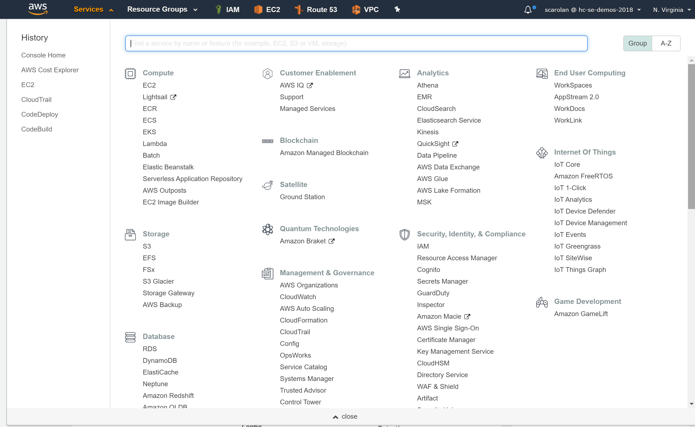
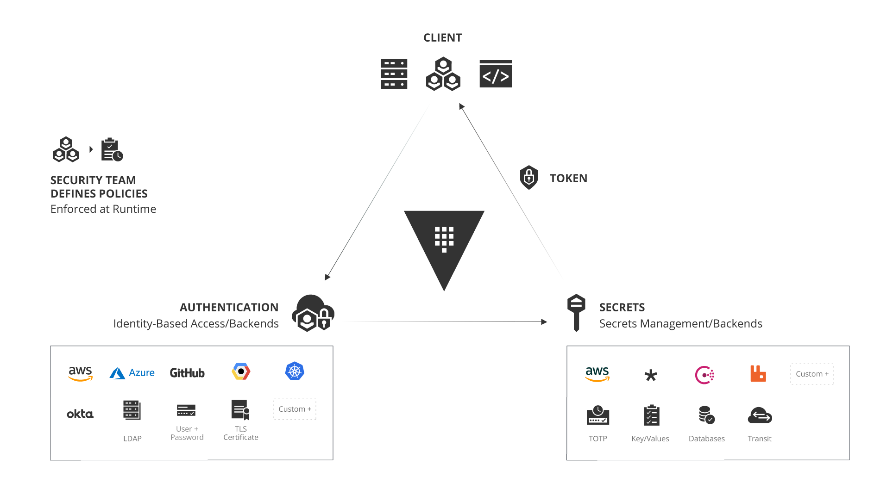

name: chapter-1
class: title, shelf, no-footer
background-image: url(https://hashicorp.github.io/field-workshops-assets/assets/bkgs/HashiCorp-Title-bkg.jpeg)
count: false

.white[
# Securing Cloud API Credentials with HashiCorp Vault

          Sean Carolan - Technical Specialist
]

???
Hi, I'm Sean and I'm a recovering sysadmin.

---
layout: true

.footer[
- 
]

---
name: back-in-my-day
class: center,middle

.center[

 Sean at the Seattle Living Computer Museum
]

???
I like to play a little game called "Back in my day..." Do you like that game? This is a back in my day moment except it happened in the Seattle Living Computer Museum. My first computer was a Commodore 64 and am old enough to remember when floppy disks were actually floppy. My first security gig was cracking copy protection on floppy disks so my friends and I could share our games.

It turned into this game of cat an mouse, where the game publishers would make you do things like type in a word from page 42 of the manual before you could load the game. So our workaround was to go into dad's office and borrow the photocopier. This was in the days before they had rap videos about software piracy.

Remember kids: Don't copy that floppy!

We can play some more "Back in my day..." at happy hour if you like. I love hearing devops war stories.

These days I'm no longer a sysadmin. I handed in the on-call pager and left the cubicle to travel around and talk about infrastructure and security.

Today we'll be talking about dynamic cloud credentials with HashiCorp Vault. Disclaimer - I am a HashiCorp employee, but this is not a sales pitch. Everything you'll see in this talk is built with open source software.

---
name: aws-console
class: center,middle

.center[

 How to turn your cloud account...
]

???
But before we talk about Vault let me share a story with you. The story is called "The Boy Who Accidentally Copied His AWS Keys to GitHub".

---
name: bitcoin-farm-simulator
class: center,middle

.center[

 ...into a cryptocurrency farm in three easy steps!
]

???
Also known as "How to turn your cloud account into a cryptocurrency farm in 3 easy steps."

And in case you're curious the lead role in this story is played by yours truly.

Once upon a time there was a solutions engineer who wanted to build a terraform demo. Our hero needed some code.

And what do we do when we need code?

We go to stack overflow and we copy it!

I had a copy of my old Terraform tutorial in another repo. And I had dutifully put a .gitignore file into my repository so that my credentials file would not be copied to the remote repo. I used my handy `cp -r` command to copy everything in that repo, into a new repo where I could build my demo.

Guess which file didn't get copied into the new repository? That's right, that single hidden .gitignore file that was the only thing protecting the credentials was gone. The safety switch on the footgun was set to OFF.

And so the stage was set. You can probably guess what happened next.

git add...git commit...git push...

Hey, how come I can't log onto the AWS console anymore?

Oh gosh the API isn't working either. I wonder if AWS is having an outage?

Oh wait, nobody else can get into our account either...

And then that sinking feeling sets in. I'll spare you the details, but the short version is that a bot picked up those credentials and within two minutes had repurposed the entire AWS account into a massive cryptocurrency farm. Actually I wasn't even mad. It was amazing.

The first thing the attacker did was create themselves a new admin account with a very generic looking name. Next they disabled all the other admin accounts to lock everyone else out. And then systematically began spinning up the maximum number of ec2 instances of each size, in every single region. Oh, and every one of those instances had termination protection turned on.

Fortunately our security and operations folks were able to quickly close access to the account and shut down all the instances, but not before they'd run up a $20,000 bill in less than an hour.

Cloud API credentials are powerful. If your cloud account were a data center, these admin level API keys are like a skeleton key that can open the front door, every server cabinet, and every single server. And also this magic key lets you order hundreds more servers and have them delivered and turned on instantly.

Now every time I see AWS keys in plain text I have a mini panic attack. Turns out I'm not alone. Thousands of API keys are accidentally pushed to github every single day.

How can we better manage these credentials and reduce the amount of risk in our cloud environments?

One way to manage API credentials is with HashiCorp Vault.

---
name: hashiCorp-vault-overview
# HashiCorp Vault Overview

  * HashiCorp Vault is an API-driven, cloud agnostic secrets management system.
  * It allows you to safely store and manage sensitive data in hybrid cloud environments.
  * You can also use Vault to generate dynamic short-lived credentials, or encrypt application data on the fly.

???
This is meant as a high level overview.  For detailed descriptions or instructions please see the docs, API guide, or learning site:
* https://www.vaultproject.io/docs/
* https://www.vaultproject.io/api/
* https://learn.hashicorp.com/vault/

---
name: the-old-way
# The Traditional Security Model
.center[]
.center[Also known as the "Castle and Moat" method.]

???
* This picture shows the traditional castle and moat security model.

---
name: traditional-security-models
# The Traditional Security Model
* Traditional security models were built upon the idea of perimeter based security.
* There would be a firewall, and inside that firewall it was assumed one was safe.
* Resources such as databases were mostly static.  As such rules were based upon IP address, credentials were baked into source code or kept in a static file on disk.

???
This slide discusses the traditional security model

---
name: problems-with-traditional-security-models
# Problems with the Traditional Security Model
* IP Address based rules
* Hardcoded credentials with problems such as:
  * Shared service accounts for apps and users
  * Difficult to rotate, decommission, and determine who has access
  * Revoking compromised credentials could break

???
* This slide describes some of the problems with the traditional security model.
---
name: the-new-way
# Modern Secrets Management
.center[]
.center[No well defined perimeter; security enforced by identity.]

???
* These are Mongolian Yurts or "Ger" as they are called locally. Instead of a castle with walls and a drawbridge, a fixed fortress that has an inside and an outside, these people move from place to place, bringing their houses with them.

* And if you don't think the Nomadic way can be an effective security posture, think about this for a moment. The Mongol military tactics and organization enabled the Genghis Khan to conquer nearly all of continental Asia, the Middle East and parts of eastern Europe. Mongol warriors would typically bring three or four horses with them, so they could rotate through the horses and go farther. Mongol army units could move up to 100 miles a day, which was unheard of in the 13th century. They were faster, more adaptable, and more resilient than all their enemies.

---
name: identity-based-security-1
#Identity Based Security
.center[]
.center[[Identity Based Security and Low Trust Networks](https://www.hashicorp.com/identity-based-security-and-low-trust-networks)
]

???
* Here we see that Vault has multiple means of authenticating users and applications with its Auth Methods.
* Vault can manage many types of secrets and excels at generating short-lived, dynmamic secrets.
* Vault's ACL policies are associated with tokens that users and applications use to access secrets after authenticating.
* Tokens can only read/write secrets that its policies allow.
* Click on the link to read a white paper about identity-based security in low trust networks.

---
name: identity-based-security-2
# Identity Based Security

Vault was designed to address the security needs of modern applications.  It differs from the traditional approach by using:

* Identity based rules allowing security to stretch across network perimeters
* Dynamic, short lived credentials that are rotated frequently
* Individual accounts to maintain provenance (tie action back to entity)
* Credentials and Entities that can easily be invalidated

???
* This slide discusses how Vault is designed for modern applications.

---
name: secrets-engines
# Vault Secrets Engines
.center[]
.center[[Vault Secrets Engines](https://www.vaultproject.io/docs/secrets/index.html)]

???
* Vault provides many out-of-the-box secrets engines.
* Additional custom secrets engines can be added by customers.
* Click on the link to learn more about Vault secrets engines.

---
name: vault-reference-architecture-1
# Vault Architecture Internals
.center[]
.center[[HashiCorp Vault Internals Architecture](https://www.vaultproject.io/docs/internals/architecture.html)
]

???
* Click the link to learn more about the internal's of Vault's architecture.

---
name: vault-reference-architecture-2
# Vault Architecture - High Availability
.center[]
.center[[Vault High Availability](https://www.vaultproject.io/docs/concepts/ha.html)
]

???
* Vault allows multiple servers to be combined in a highly available cluster within a single cloud region or physical data center.
* Click on the link to learn more about Vault's high availability in a single cluster.

---
name: vault-dynamic-secrets
# Dynamic Secrets with Vault
.center[]

Vault can provide disposable credentials that are limited in time and scope, similar to a hotel room card key.

---
name: Live-Demo
class: title
# Live Demo

---
name: thank-you
class: img-caption

# Thank you from all of us at HashiCorp!

