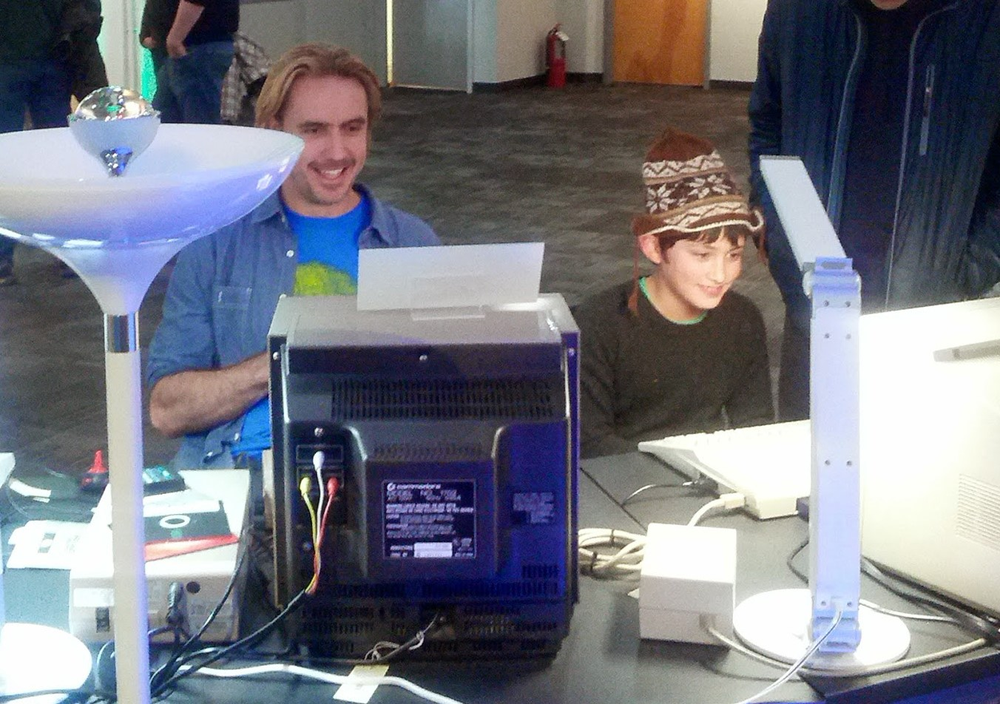
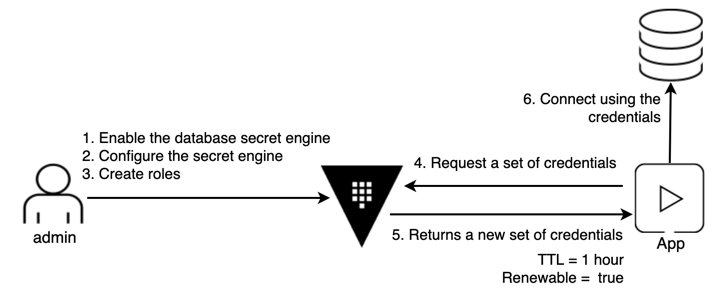

name: chapter-1
class: title, shelf, no-footer
background-image: url(https://hashicorp.github.io/field-workshops-assets/assets/bkgs/HashiCorp-Title-bkg.jpeg)
count: false

.white[ 
# Securing Cloud API Credentials with HashiCorp Vault

          Sean Carolan - Technical Specialist
]

???
Chapter 1 introduces Vault

---
layout: true

.footer[
- 
]

---
name: Retro
class: center,middle

.center[

 Sean at the Seattle Computer Museum
]

???
My name is Sean Carolan and I'm a Solutions Engineer with HashiCorp. I like building things. In my past life I was a Linux system administrator, now I travel and help users get started with Infrastructure as Code. My first computer was a Commodore 64. 

This photo was taken a few years ago at the Living Computer Museum. If you are ever in Seattle, you owe it to yourself to make a pilgrimage to this place. There's nothing that makes you feel old like seeing your childhood toy in a museum. Elliot and I are playing Oregon Trail on an Apple IIe.

Password Rotation!  Woooo!  Who's with me?  No...nobody?  Why isn't anyone excited?  Are you sure you don't want to go hear about Terraform 0.12?  Ok, you're stuck with me!

Let's be honest, nobody came to this talk because they like changing passwords. I'll give you an example...(Advance to Next slide)

---
name: hashiCorp-vault-overview
# HashiCorp Vault Overview

  * HashiCorp Vault is an API-driven, cloud agnostic secrets management system.
  * It allows you to safely store and manage sensitive data in hybrid cloud environments.
  * You can also use Vault to generate dynamic short-lived credentials, or encrypt application data on the fly.

???
This is meant as a high level overview.  For detailed descriptions or instructions please see the docs, API guide, or learning site:
* https://www.vaultproject.io/docs/
* https://www.vaultproject.io/api/
* https://learn.hashicorp.com/vault/

---
name: the-old-way
# The Traditional Security Model
.center[]
.center[Also known as the "Castle and Moat" method.]

???
* This picture shows the traditional castle and moat security model.

---
name: traditional-security-models
# The Traditional Security Model
* Traditional security models were built upon the idea of perimeter based security.
* There would be a firewall, and inside that firewall it was assumed one was safe.
* Resources such as databases were mostly static.  As such rules were based upon IP address, credentials were baked into source code or kept in a static file on disk.

???
This slide discusses the traditional security model

---
name: problems-with-traditional-security-models
# Problems with the Traditional Security Model
* IP Address based rules
* Hardcoded credentials with problems such as:
  * Shared service accounts for apps and users
  * Difficult to rotate, decommission, and determine who has access
  * Revoking compromised credentials could break

???
* This slide describes some of the problems with the traditional security model.
---
name: the-new-way
# Modern Secrets Management
.center[]
.center[No well defined perimeter; security enforced by identity.]

???
* These are Mongolian Yurts or "Ger" as they are called locally. Instead of a castle with walls and a drawbridge, a fixed fortress that has an inside and an outside, these people move from place to place, bringing their houses with them.

* And if you don't think the Nomadic way can be an effective security posture, think about this for a moment. The Mongol military tactics and organization enabled the Genghis Khan to conquer nearly all of continental Asia, the Middle East and parts of eastern Europe. Mongol warriors would typically bring three or four horses with them, so they could rotate through the horses and go farther. Mongol army units could move up to 100 miles a day, which was unheard of in the 13th century. They were faster, more adaptable, and more resilient than all their enemies.

---
name: identity-based-security-1
#Identity Based Security
.center[]
.center[[Identity Based Security and Low Trust Networks](https://www.hashicorp.com/identity-based-security-and-low-trust-networks)
]

???
* Here we see that Vault has multiple means of authenticating users and applications with its Auth Methods.
* Vault can manage many types of secrets and excels at generating short-lived, dynmamic secrets.
* Vault's ACL policies are associated with tokens that users and applications use to access secrets after authenticating.
* Tokens can only read/write secrets that its policies allow.
* Click on the link to read a white paper about identity-based security in low trust networks.

---
name: identity-based-security-2
# Identity Based Security

Vault was designed to address the security needs of modern applications.  It differs from the traditional approach by using:

* Identity based rules allowing security to stretch across network perimeters
* Dynamic, short lived credentials that are rotated frequently
* Individual accounts to maintain provenance (tie action back to entity)
* Credentials and Entities that can easily be invalidated

???
* This slide discusses how Vault is designed for modern applications.

---
name: secrets-engines
# Vault Secrets Engines
.center[]
.center[[Vault Secrets Engines](https://www.vaultproject.io/docs/secrets/index.html)]

???
* Vault provides many out-of-the-box secrets engines.
* Additional custom secrets engines can be added by customers.
* Click on the link to learn more about Vault secrets engines.

---
name: vault-reference-architecture-1
# Vault Architecture Internals
.center[]
.center[[HashiCorp Vault Internals Architecture](https://www.vaultproject.io/docs/internals/architecture.html)
]

???
* Click the link to learn more about the internal's of Vault's architecture.

---
name: vault-reference-architecture-2
# Vault Architecture - High Availability
.center[]
.center[[Vault High Availability](https://www.vaultproject.io/docs/concepts/ha.html)
]

???
* Vault allows multiple servers to be combined in a highly available cluster within a single cloud region or physical data center.
* Click on the link to learn more about Vault's high availability in a single cluster.

---
name: vault-dynamic-secrets
# Dynamic Secrets with Vault
.center[]

Vault can provide disposable credentials that are limited in time and scope, similar to a hotel room card key.

---
name: Live-Demo
class: title
# Live Demo

---
name: thank-you
class: img-caption

# Thank you from all of us at HashiCorp!

