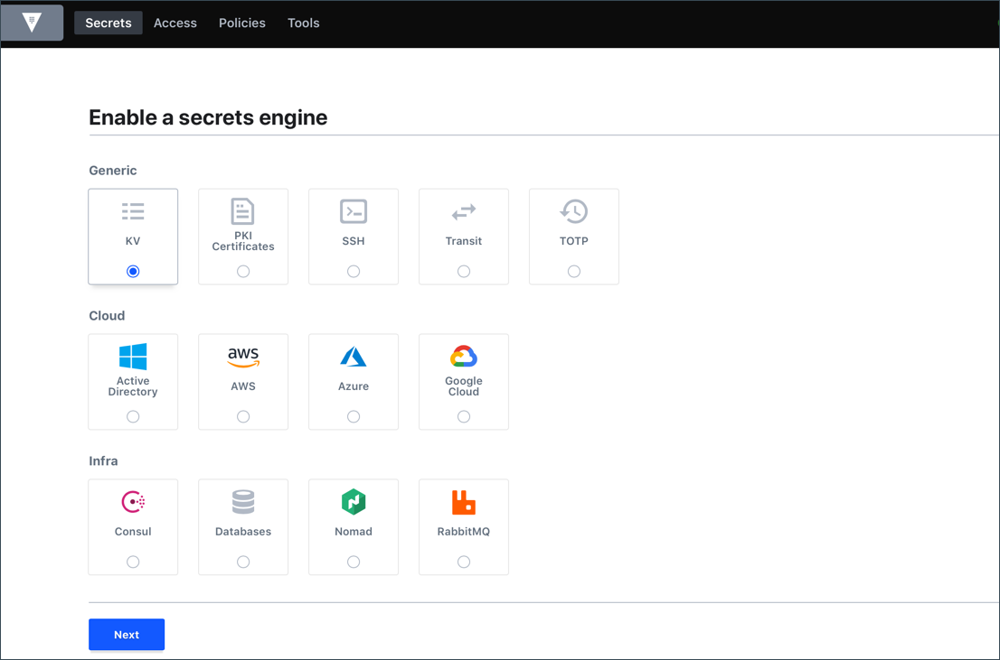

name: chapter-1
class: center,middle
count: false

# Modern Secrets Management With HashiCorp Vault

???
Hello everyone and thank you for joining us today. My name is Sean Carolan and I'm a solutions engineer with HashiCorp. Today I'll show you how Vault can solve your secrets management problems now and in the future. Before we jump into the presentation and demo let's do a quick round of introductions. 

---
layout: true

.footer[
- 
]

---
name: the-challenge
# The Challenge
.center[

]

Spacely Space Sprockets needs to manage and protect secrets like passwords and certificates in both data center and cloud environments.

???
We've had a couple of discovery meetings already where I spoke with ________ about your cloud migration project. My understanding is that you're moving one of your ecommerce applications to AWS and that you need a secrets management solution that works well in the cloud. We also know that you are current users of Cyberark and would like to know what the key differences are between the two products. Does this slide describe the problem statement accurately? Before I go further are there any must-have features or outcomes that you require?

Great. I am your technical resource and my job is to show you how Vault can solve your secrets management problems both in the data center and in the cloud. One thing I won't cover today is pricing. Your sales rep couldn't be with us today but she will be more than happy to have a separate discussion about that. Vault is open source software so the price scale begins at zero and the enterprise offering is priced very competitively compared to Cyberark.

---
name: risks-of-doing-nothing
# Why Change? Why Now? Why Vault?

.center[]

* Existing manual processes don't translate well to cloud
* Plain text secrets represent a significant security risk
* The future is powered by API-driven automation

.center[.small[Cartoon by Andrew Grossman]]

???
Every modern IT organization is faced with these three questions. IT infrastructure technology is changing rapidly, and organizations that do not figure out how to adapt will struggle to compete in the world of always-on, cloud-based applications.

Have any of you worked on a cloud migration project before? You probably have some war stories to tell. Unfortunately the lift-and-shift approach, where we simply copy entire virtual machines into the cloud, doesn't help much. Sometimes it can actually be harmful, because we're moving our outdated processes onto someone elses infrastructure. The temptation is to cut corners and simply migrate all your existing stuff into AWS and call it a day. Let me give you an example, I worked with one particular client who hired a partner to move one of their apps to the cloud. They had a deadline and a mandate and not a lot of time to plan it out properly. So they ended up paying a lot of money to run virtual Netscalers on AWS. Yes, you can have a virtual netscaler load balancer, and yes they are really expensive. This is just one example of something that worked OK in the data center, but should have been refactored for the cloud environment.

Another problem is what we call 'secret sprawl'. Passwords, keys, credentials stored in plain text. Or maybe you have some kind of password vault in your office or data center. Often these credentials are hard-coded into configuration files. While not ideal, this worked well enough in a secure data center. But now that you have to run your application on someone else's network things are a lot more complex. There are many more vectors for attack, and there are also a lot more secrets to manage in the cloud.

Good automation is a key component for success in the cloud. Manually managing passwords and keys will slow you down and cause users to cut corners or not secure their credentials correctly.

Hope is not a strategy. Let's take a closer look at some of the risks associated with doing nothing.

---
name: average-cost-of-a-breach
# Security Breaches are Expensive

???
Does anyone want to take a guess at the average cost of a data breach?

---
name: average-cost-of-a-breach
# Security Breaches are Expensive
.center[]

.center[https://www.ibm.com/security/data-breach]

???
IBM has a research project that they update every year showing the *average* cost of a data breach for large companies like yours. 3.9 million dollars. Remember that's just the average. We know that on the high end this can reach into the hundreds of millions or even billions of dollars. According to Equifax, their data breach cost 1.4 Billion dollars. And on the low end there are thousands of smaller incidents that cost tens or hundreds of thousands of dollars to remedy.

I'm not here to scare you into using Vault. But I will share this interesting tidbit. 100% of our prospects who have suffered a data breach become customers within the next 6 months.

---
name: old-way-is-slow
# Manual Processes are SLOW
.center[]

.center[
Users expect automatic updates and real-time data
]

???
Think about how different your business looks today compared to 20 years ago. Or even 10 years ago.

Here's some fun trivia - anyone know what the first food ordered on the Internet was? Pizza! In 1994 the first internet food order was placed. Fast forward to today, having a website and smartphone app is table stakes. Customers want to interact with you in real-time from their phones and tablets. We've all come to expect automatic updates that just happen in the background. Think about how you update your phone. Most of us leave auto-update on and let the apps take care of themselves.

The "Down for Maintenance" page that was once so common is now a sign that you're behind the times. Users expect 24x7 uptime. This puts a lot of pressure on the business to go fast and deliver new features, while maintaining four or five nines of uptime, and keeping everything secure while you do it. Oh and if that weren't enough you have to manage the legacy stuff in the data center while you move to cloud.

---
name: modern-devops-automation
# Password Management is Hard
 

.center[

 .small[Security Admin Enforces Password Rotation]
]

Enforcing password complexity and rotation is a neverending task.

???
Managing credentials that are owned by humans or applications, or sometimes both, can be a daunting task. You have to nag your users non-stop to update their passwords. Passwords are actually a terrible authentication mechanism, but we're stuck with them. Sometimes you are legally required to rotate passwords every X number of days. How do you manage the rotation? You can nag the user to do it, you can force a password change (but careful not to break anything), or you can install some kind of agent that updates the passwords on your machines for you.

Doing this manually is never going to scale as you move into the cloud. You *must* have some kind of automation in place to get ahead of this.

---
name: traditional-security-models
# The Traditional Security Model
.center[

 The Castle and Moat Method
]

???
The medeival castle makes a good analogy for the traditional IT security model. You've got your four walls and a moat. Everything on the outside is considered untrusted and insecure and the stuff on the inside is trusted. You can tightly control the ingress and egress points and there are only a few of those at most. Security is all about protecting the network at all costs. You have firewalls and IDS devices and maybe you block traffic from specific ip addresses.

In this world passwords are only used for internal access to systems over a VPN or backplane network. The attack surface is well known and understood.

---
name: problems-with-passwords
# Problems With Passwords
  

???
The problem with this model is it doesn't translate well to the cloud. In the cloud you don't have control over the network, and the cloud API grants literally hundreds of new potential entry points into your infrastructure. Now those passwords and credentials just became a LOT more dangerous because they can unlock many more doors.

---
name: problems-with-passwords
# Problems With Passwords
  
  * Shared service accounts for apps and users

???
Let's focus on some of the problems with passwords. Password sharing! Maybe multiple users on the same team are sharing a password. Who knows what they've done with it. Or maybe you have the same password configured on a dozen different application servers, all accessing the same database. Sometimes you have users logging on using system accounts. The list goes on.

---
name: problems-with-passwords
# Problems With Passwords
  
  * Shared service accounts for apps and users
  * Difficult to rotate, decommission, and determine who has access

???
When is it safe to delete or update a password? Do you know with certainty, all the places that this password is being used? 

---
name: problems-with-passwords
# Problems With Passwords
  
  * Shared service accounts for apps and users
  * Difficult to rotate, decommission, and determine who has access
  * Revoking compromised credentials could break things

???
There's always a small chance that revoking compromised credentials could break things. Now you have a security breach *and* an outage to deal with.

---
name: hashiCorp-vault-overview
# Modern Secrets Management with Vault
.center[]
  * Vault is an API-driven, multi-cloud secrets management system.
  * Access and manage it with the web GUI, API or command line.
  * Safely store and manage sensitive data in hybrid cloud environments.
  * Generate dynamic short-lived credentials like cloud API keys.

???
The solution to your multi-cloud secrets management challenge is HashiCorp Vault. Vault was designed by HashiCorp to manage sensitive data provided to us by our customers. We initially tried to buy a tool, but we couldn't find one that checked the boxes for all our requirements. Vault is a highly available, API driven secrets management system that works in the cloud or your data center. Vault can be accessed via the GUI, command line, or API. It allows you to safely store and manage credentials and other sensitive data even on networks you don't own or control. You keep the master key and even your cloud provider won't be able to access the data stored in your Vault cluster.

---
name: vault-reference-architecture-2
# Vault Architecture - High Availability
.center[]

???
This presentation wouldn't be complete without at least a passing mention of Vault's HA capabilities. Out of the box, a single open-source Vault cluster can tolerate the failure of an entire cloud zone. Vault Enterprise offers multi-region replication and disaster recovery for regional failures.

The key takeaway here is that Vault can run in either your data center, your cloud environment, or you can even replicate between both and have all your secrets available everywhere. Some of our largest customers have 30 or 40 Vault clusters in replication groups.

Some of our banking customers process millions of transactions per day, and depend on Vault to keep entire financial exchanges running smoothly and securely. Vault is robust, scalable, and reliable for even the most demanding workloads.

---
name: identity-based-security-1
#Identity Based Security
.center[]

???
In the previous castle-and-moat slide we talked about perimeter or network-based security. Vault takes a different approach. Vault is designed to not trust anything outside itself. Access to Vault is granted by identity. Here's a quick overview to help you understand how Vault works at a high level.

First is Authentication. Whether you are a human or an application you must first authenticate yourself to Vault. There are over a dozen supported auth methods that you can use right out of the box. These include Active Directory or LDAP, Okta, Username and Password, TLS certificate, or even your cloud provider. AWS instances and containers, for example, can authenticate to Vault without any credentials at all. The most secure password is no password at all!

---
name: identity-based-security-2
# Identity Based Security

Vault was designed to address the security needs of modern applications.

???
We took our wish list, everything we would want in a modern secrets management tool, and built it into Vault.

---
name: identity-based-security-2
# Identity Based Security

Vault was designed to address the security needs of modern applications.

* Identity based security that extends across network perimeters

???
Identity based security allows you to safely run your applications even on untrusted networks.

---
name: identity-based-security-2
# Identity Based Security

Vault was designed to address the security needs of modern applications.

* Identity based security that extends across network perimeters
* Dynamic, short lived credentials that are generated on demand

???
Vault can not only store your existing passwords, it can also generate temporary, expiring credentials.

---
name: identity-based-security-2
# Identity Based Security

Vault was designed to address the security needs of modern applications.

* Identity based security that extends across network perimeters
* Dynamic, short lived credentials that are generated on demand
* Individual accounts and apps tied to specific credentials

???
Every generated credential is tied back to a specific application or individual person. No guesswork when you need to know whose credentials they are. And no more need to share passwords across multiple applications or users.

---
name: identity-based-security-2
# Identity Based Security

Vault was designed to address the security needs of modern applications.

* Identity based security that extends across network perimeters
* Dynamic, short lived credentials that are generated on demand
* Individual accounts and apps tied to specific credentials
* Credentials and tokens that can easily be invalidated

???
Vault gives you a "Break Glass in Case of Emergency" button. You can invalidate individual credentials, or even entire groups of credentials. Rotating passwords becomes a thing of the past.

---
name: secrets-engines
# Vault Secrets Engines
.center[]

???
Think of Vault like a swiss army knife or multi-tool. These secrets engines provide different functions and features. You can easily enable as many of these as your like, or multiple instances of them for different use cases.

* Vault provides many out-of-the-box secrets engines.
* Additional custom secrets engines can be added by customers.
* Click on the link to learn more about Vault secrets engines.

---
name: the-old-way
# The Old Way: Static Credentials
 
.center[]
.center[Static credentials are hard to rotate and easy to steal.]

???
Here's a little analogy to help you understand how Vault's dynamic credentials work. Some of you may be old enough to remember when hotel keys looked like this. Well maybe not exactly like this but you get the idea. It was a physical key that came with a $50 replacement fee if you lost it. And losing your hotel room key was a big deal. These keys could also be stolen, or copied, and the process of changing the lock is not trivial.

---
name: the-new-way
# The New Way: Dynamic Expiring Credentials
 
.center[]
.center[Dynamic credentials are short-lived and limited in scope.]

???
The modern hotel, on the other hand, uses electronic card keys. Think about the first thing you get asked when you enter a hotel and approach the front desk. "May I see your identification and credit card please?" Vault is just like that front desk. You identify yourself, and the front desk staff issues you temporary credentials in the form of a key card. That key card is granted temporary, limited access to certain parts of the hotel. The key can be instantly invalidated, and a new one can be created on demand. So if you accidentally lock yourself out of your room, you simply approach the front desk and identify yourself to get a new key.

---
name: vault-dynamic-secrets
# Dynamic Secrets with Vault
.center[]

Vault can provide disposable credentials that are limited in time and scope, similar to a hotel room card key.

???
In just a moment we're going to do a live demo showing off two features of Vault. The first is password and credentials storage. The second, more exciting part of the demo highlights Vault's dynamic cloud credentials feature. The diagram here shows the same process we will demo, but for a database server. Vault has a special system account that it uses to generate new credentials. The flow looks like what you see here on the diagram. (Walk through diagram.)

---
name: Live-Demo
 <br    
.center[
# Live Demo
]
.center[
https://play.instruqt.com/hashicorp/tracks/vault-aws-dynamic-secrets
]

???
This is a live demo that you can also do on your own. The link on this slide leads to a web-based tutorial that uses a real AWS account and a real Vault server to generate expiring AWS keys. Let's do the demo!

---
name: Wrap-Up
# Summary

HashiCorp Vault is a modern, API-driven, multi-cloud secrets management system.

Vault allows you to:

* Securely store and manage existing passwords and credentials.
* Generate short-lived cloud API keys tied to identity.
* Make cumbersome password rotation a thing of the past.
* Secure your data now and in the future.
* Handle secrets management for *all* your environments, whether in the data center or cloud.